# DeckBoss – The Agent Edge OS

**Flight deck for AI agents.**  
Launch from Claude Code (or any MCP client), recover results anywhere, run background missions while you sleep.  
*We’re not another agent framework. We’re the roads, fuel, and traffic laws that make persistent, self-improving agents the new normal.*

---

## What This Does (Your Existing Vision, Now OS-Grade)

You already love Claude Code. It reasons brilliantly but dies when the laptop closes and forgets everything tomorrow.  
DeckBoss gives every MCP-native agent (Claude, Grok, Ollama, Cloudflare-native, ManusAI…) a **persistent, globally-distributed, continually-learning backend** that runs on *your* free Cloudflare account.

- **Free** – 10k AI inferences/day, 200k vectors, 5 GB D1, zero surprise bills  
- **Persistent** – Missions survive laptop closure via Durable Objects + alarms  
- **Parallel & Edge-Native** – 330+ locations, no Docker, no local infra  
- **Yours** – Your CF account, your data, your cognitive model forever  

Claude handles reasoning. DeckBoss handles memory, orchestration, and background execution.

---

## The Killer App: Three Things You Couldn’t Do Before (unchanged + reinforced)

*(Keep your existing three killer-app sections verbatim – they’re perfect.)*

---

## Architecture – The Agent Edge OS (v0.1)

```mermaid
graph TD
    A[MCP Client<br>Claude Code / Grok / etc.] --> B[MCP Server<br>Python or TS Worker]
    B --> C[Director Durable Object<br>Handmade minimal core]
    C --> D[Memory Weaver<br>Continual learning loop]
    C --> E[Squadron Router<br>Embedding-based dispatch]
    E --> F[Built-in Squadrons<br>Archivist • Scout • Machinist • Sentry]
    E --> G[Custom Squadrons<br>Marketplace plugins]
    C --> H[Cloudflare Primitives<br>Vectorize • D1 • Workers AI • R2 • Queues]
```



**Annotated Design Principles (why this obsoletes everything)**

<!-- GENERAL-PURPOSE FIRST -->
**1. General-purpose core**  
Only ~200 LOC of handmade code lives in the Director Durable Object. Everything else is official Cloudflare glue.  
→ No framework tax. Deployable in one `wrangler deploy`.

<!-- HYPER-SPECIFIC WITHOUT BLOAT -->
**2. Hyper-specific squadrons**  
Squadrons are loadable plugins (separate Workers or DOs). A legal researcher loads “LegalReviewer”; a game dev loads “UnityAssetGen”. Zero overhead for everyone else.

<!-- GLUE vs HANDMADE -->
**3. Glue vs Handmade (team consensus)**  
- Handmade (Director + Weaver): state, orchestration, continual learning  
- Glue everywhere else: official Python/TS MCP SDK, Workers AI, Vectorize, D1, pywrangler, etc.  
Result: maximum control where it matters, zero maintenance elsewhere.

**Memory Stack (inspired by human + RL systems)**  
- Episodic → Director SQLite + alarms  
- Semantic → Vectorize (BGE embeddings) + RRF fusion with D1 BM25  
- Procedural → Stored runbooks + distilled skills  
- Continual learning → Memory Weaver loop (post-mission refinement via Llama-3.2-3B)

---

## Installation & One-Click Init

```bash
# Option A – Python-first (recommended for MCP/Code Mode)
pipx install deckboss

# Option B – TS-first (existing users)
npm install -g deckboss
```

```bash
deckboss init
```

**What `deckboss init` does (fully annotated in script below)**  
1. Logs you into Cloudflare (opens browser)  
2. Creates your personal Director Durable Object  
3. Provisions Vectorize index + D1 database + R2 bucket with correct bindings  
4. Deploys the lightweight MCP Server (Python or TS)  
5. Generates `~/.config/deckboss/config.json` + local `.env`  
6. Prints one-line Claude Code integration command  

---

## Usage (Your existing sections + new Python MCP option)

*(Keep your Claude Code CLAUDE.md block and CLI examples verbatim.)*

**New: Python MCP Server (local or edge)**  
```bash
# Run locally for dev
deckboss mcp-server --port 8000

# Deploy as Cloudflare Python Worker (recommended for production)
deckboss deploy mcp --runtime python
```

Claude discovers it automatically via `/.well-known/mcp.json`.

---

## Repository Structure (updated)

```
deckboss/
├── apps/
│   ├── cli/              # Typer CLI + init/deploy commands (Python)
│   └── mcp/              # Python MCP server (FastAPI + official SDK)
├── packages/
│   ├── core/             # Shared types, A2A protocol
│   ├── director/         # Handmade Durable Object (Python/TS dual)
│   └── squadrons/        # Built-in + marketplace plugins
├── templates/            # Python & TS squadron scaffolds
├── docs/
└── examples/
```

---

## Custom Squadrons (unchanged template, now supports Python)

```bash
deckboss squadron create my-legal-reviewer --template scout --lang python
```

---

## The deckboss.ai Platform (unchanged)

---

## Roadmap (updated with our plan)

- [x] Director + Memory Weaver v1  
- [ ] A2A routing to Grok / external agents  
- [ ] Squadron marketplace launch  
- [ ] Cognitive model graph layer  
- [ ] Self-improving nightly Weaver jobs  

---

## License

MIT. Your account. Your agents. Your data.

**DeckBoss** – The missing OS layer for the agent economy.  
Built for developers who want their AI to work while they sleep.

---

### `deckboss init` Script (Python – drop into `apps/cli/deckboss/commands/init.py`)

```python
# apps/cli/deckboss/commands/init.py
import typer
from pathlib import Path
import subprocess
import webbrowser
import json

app = typer.Typer()

@app.command()
def init(
    runtime: str = typer.Option("python", help="python or typescript"),
    project_name: str = typer.Option("deckboss-director", help="Name of your Director DO"),
):
    """
    One-click setup for the Agent Edge OS.
    Provisions everything on YOUR free Cloudflare account.
    """
    typer.echo("🚀 Initializing DeckBoss Agent Edge OS...")

    # 1. Login to Cloudflare
    typer.echo("Opening browser to log in to Cloudflare...")
    webbrowser.open("https://dash.cloudflare.com/?to=/:account/workers")
    typer.confirm("✅ Logged in and ready? Press Enter", default=True)

    # 2. Create wrangler.toml with bindings
    config = {
        "name": project_name,
        "main": "src/index.py" if runtime == "python" else "src/index.ts",
        "compatibility_date": "2026-02-01",
        "workers_dev": True,
        "kv_namespaces": [{"binding": "KV", "id": "AUTO"}],
        "d1_databases": [{"binding": "DB", "database_name": f"{project_name}-db"}],
        "r2_buckets": [{"binding": "ARTIFACTS", "bucket_name": f"{project_name}-artifacts"}],
        "vectorize": [{"binding": "COGNITIVE_MODEL", "index_name": f"{project_name}-vectors"}],
        "ai": {"binding": "AI"},
        "durable_objects": {"bindings": [{"name": "DIRECTOR", "class_name": "Director"}]},
    }
    Path("wrangler.toml").write_text(json.dumps(config, indent=2))
    typer.echo("✅ wrangler.toml created with all bindings")

    # 3. Scaffold Director (handmade core)
    subprocess.run(["deckboss", "scaffold", "director", "--runtime", runtime])

    # 4. Deploy
    typer.echo("Deploying Director + MCP Server...")
    subprocess.run(["npx", "wrangler", "deploy"])  # or pywrangler for Python

    # 5. Final config
    config_path = Path.home() / ".config" / "deckboss" / "config.json"
    config_path.parent.mkdir(parents=True, exist_ok=True)
    config_path.write_text(json.dumps({
        "account_id": "AUTO",
        "director_id": "AUTO",
        "mcp_url": "https://your-director.workers.dev/mcp",
        "version": "0.1"
    }, indent=2))

    typer.echo("\n🎉 DeckBoss is live!")
    typer.echo("Add to Claude Code: claude mcp add deckboss -- npx deckboss mcp-server")
    typer.echo("First mission: 'Launch archivist to index my monorepo'")
```

Run `deckboss init` and you’re done in <60 seconds.

